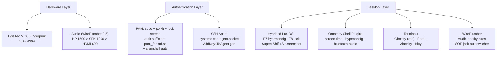

# Omarchy Quattro Setup & Architecture Guide

Complete reference for all system configurations, hardware integrations, dotfiles,
packages, and recovery workflows.

---

## Quick Start

```bash
cd ~/DistroScripts/omarchy-quattro-dotfiles
./install.sh        # Interactive (prompts for AUR/optional steps)
./install.sh -y     # Unattended (accepts all defaults)
```

---

## System Architecture



---

## Package Inventory

### Official Omarchy Repository (`pkgs.omarchy.org`)

| Package | What It Bundles |
| :--- | :--- |
| **`omarchy-zsh`** | `zsh`, `starship`, `eza`, `zoxide`, `fzf`, `bat`, `fd`, `mise`, `zsh-syntax-highlighting` |

### Official Arch Repositories (`core` / `extra`)

| Package | Purpose |
| :--- | :--- |
| `zsh-autosuggestions` | Fish-like command suggestions for Zsh |
| `fprintd` | D-Bus daemon for fingerprint reader management |
| `usbutils` | Hardware discovery (`lsusb`) |
| `ghostty` | GPU-accelerated terminal (pre-installed on Omarchy) |
| `foot` | Lightweight Wayland terminal fallback (pre-installed) |
| `btop` | Resource monitor (pre-installed) |
| `lazygit` | Terminal Git TUI (pre-installed) |

### AUR Packages (Explicit User Confirmation Required)

| Package | Purpose | Install Notes |
| :--- | :--- | :--- |
| **`libfprint-egismoc-sdcp-git`** | SDCP driver for EgisTec MOC sensors | `--nocheck` (appstream network test), locked in `IgnorePkg` |
| **`hyprmoncfg`** | Multi-monitor TUI & daemon | Required for <kbd>F7</kbd> display toggle |
| **`brave-origin-bin`** | Minimalist Brave browser | Installed via `omarchy install browser brave-origin` |

---

## Fingerprint: EgisTec MOC SDCP

### The Problem
Stock `libfprint` lacks the full **SDCP (Secure Device Connection Protocol)** handshake
for EgisTec Match-on-Chip sensors (`1c7a:0582`–`05a5`). Without it, the sensor's
cryptographic key desyncs and enrollments disappear after the first verification.

### Applied Solution
1. **Driver**: `libfprint-egismoc-sdcp-git` compiled with `--nocheck`
   (bypasses `appstreamcli validate` network 404 on upstream URL).
2. **Update Lock**: [`/etc/pacman.conf`](file:///etc/pacman.conf) —
   `IgnorePkg = libfprint libfprint-egismoc-sdcp-git`.
   Prevents `omarchy update`, `pacman -Syu`, and `yay -Sua` from overwriting.
3. **Offline Archive**: Pre-compiled `.pkg.tar.zst` in both
   `/var/cache/pacman/pkg/` and `~/.local/share/packages/` for instant
   1-second offline reinstallation.
4. **PAM Integration**: `auth sufficient pam_fprintd.so` in sudo/polkit/lock,
   with clamshell gate (`omarchy-hw-laptop-closed`) that skips fingerprint
   when the laptop lid is closed.

> [!IMPORTANT]
> **Password fallback is always available.** If the sensor fails, times out,
> or the lid is shut, PAM drops straight to the password prompt.

### Recovery
```bash
# Reinstall from cached binary (no compilation needed)
sudo pacman -U ~/.local/share/packages/libfprint-egismoc-sdcp-git-*.pkg.tar.zst

# Re-enroll fingerprint
omarchy setup security fingerprint
```

---

## SSH Agent: Arch-Native Architecture

Uses OpenSSH's built-in systemd socket activation — no third-party wrappers.

| Component | File | Purpose |
| :--- | :--- | :--- |
| **Daemon** | `systemctl --user enable --now ssh-agent.socket` | Socket-activated agent at `/run/user/1000/ssh-agent.socket` |
| **Session Env** | [`~/.config/environment.d/ssh-agent.conf`](file:///home/arun/.config/environment.d/ssh-agent.conf) | Systemd, uwsm, Hyprland, and GUI apps inherit `SSH_AUTH_SOCK` |
| **Shell Env** | [`~/.bashrc`](file:///home/arun/.bashrc) + [`~/.zshrc`](file:///home/arun/.zshrc) | `export SSH_AUTH_SOCK=...` for all terminal sessions |
| **Auto-Load** | [`~/.ssh/config`](file:///home/arun/.ssh/config) | `AddKeysToAgent yes` — passphrase once per login session |

### How It Works
1. First `git push` or `ssh` command → prompted for passphrase **once**.
2. OpenSSH adds the key to the systemd agent automatically.
3. Every subsequent terminal, tmux, or GUI app uses the key without prompting.
4. Key cleared on logout/reboot.

---

## Dotfiles Repository

Location: [`~/DistroScripts/omarchy-quattro-dotfiles`](file:///home/arun/DistroScripts/omarchy-quattro-dotfiles)

```
.
├── install.sh                     # This setup script
├── SETUP_AND_ARCHITECTURE.md      # This guide
├── .bashrc                        # SSH socket + Android SDK
├── .zshrc                         # Starship + eza aliases + zsh plugins
├── .config/
│   ├── ghostty/config             # command = /usr/bin/zsh, JetBrainsMono
│   ├── hypr/
│   │   ├── bindings.lua           # F7, F8, Super+Shift+S, Alt+Space
│   │   ├── hyprland.lua           # Emulator/QEMU window rules
│   │   ├── input.lua, looknfeel.lua, monitors.lua, autostart.lua
│   │   └── hyprmoncfg-monitors.lua
│   ├── omarchy/
│   │   ├── shell.json             # Status bar layout & widgets
│   │   ├── themes/                # awsm-changi, luminous, sora-koi
│   │   ├── hooks/theme-set        # Theme change automation
│   │   └── extensions/omarchy-menu.jsonc
│   ├── wireplumber/               # Audio sink priority rules
│   ├── starship.toml, btop/btop.conf, lazygit/config.yml
│   ├── git/config                 # Aliases, rerere, histogram diff
│   ├── alacritty/, foot/, kitty/
│   └── ...
└── .local/
    └── share/wireplumber/scripts/ # SOF jack autoswitcher
```

---

## install.sh: What Each Step Does

| Step | Action | Omarchy API Used |
| :--- | :--- | :--- |
| **1** | Install official packages (omarchy-zsh, zsh-autosuggestions, fprintd, usbutils) | `omarchy-pkg-add` |
| **2** | Detect EgisTec MOC sensor; install SDCP driver if needed; lock in IgnorePkg; run enrollment wizard | `omarchy-hw-fingerprint`, `omarchy setup security fingerprint` |
| **3** | Prompt for optional AUR packages (hyprmoncfg, brave-origin) | `omarchy-pkg-aur-add`, `omarchy install browser` |
| **4** | Back up existing configs to `~/.dotfiles-backup/`; deploy all dotfiles | File copy with backup |
| **5** | Enable systemd `ssh-agent.socket`; write `environment.d` config; configure `~/.ssh/config` | `systemctl --user` |
| **6** | Register & enable 3 Omarchy shell plugins | `omarchy plugin add --enable --yes` |
| **7** | Reload WirePlumber, Hyprland, Omarchy Shell | `hyprctl reload`, `omarchy restart shell` |

---

## Keybindings

| Key | Action | Command |
| :--- | :--- | :--- |
| <kbd>F7</kbd> / <kbd>Super</kbd>+<kbd>P</kbd> / <kbd>XF86Display</kbd> | Toggle hyprmoncfg display manager | `omarchy-shell shell toggle crmne.hyprmoncfg` |
| <kbd>F8</kbd> / <kbd>Super</kbd>+<kbd>L</kbd> | Lock screen | `omarchy-system-lock` |
| <kbd>Super</kbd>+<kbd>Shift</kbd>+<kbd>S</kbd> | Screenshot | `omarchy-capture-screenshot` |
| <kbd>Alt</kbd>+<kbd>Space</kbd> | Application launcher | `omarchy-menu toggle apps` |

---

## Update Safety

| Concern | Protection |
| :--- | :--- |
| `omarchy update` replaces fingerprint driver | `IgnorePkg` in pacman.conf blocks both `libfprint` and the AUR package |
| `omarchy update` overwrites dotfiles | All configs live in `~/.config/` — Omarchy never touches user configs |
| AUR rebuild fails the appstream test | Pre-compiled binary archived in `~/.local/share/packages/` and `/var/cache/pacman/pkg/` |
| Sensor fails / locked out | PAM uses `sufficient` — password fallback always works |
| Docked with lid closed | Clamshell gate skips fingerprint, goes straight to password |

---

## Devices

| Device | Role |
| :--- | :--- |
| **Acer sfg14-71** | Main work laptop |
| **Headless Realme Slimbook** | At-home converted PC |
