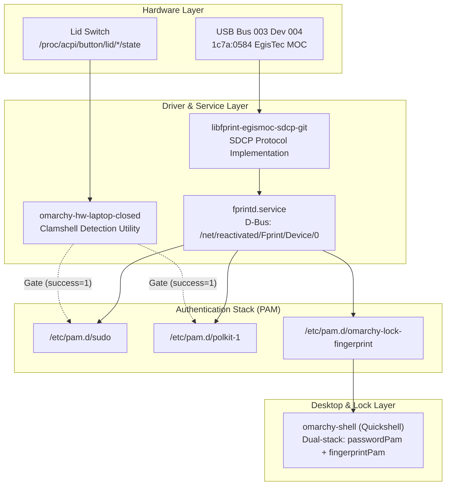

# Omarchy Quattro System Health & Authentication Audit

Comprehensive health report, PAM architecture analysis, hardware driver audit, and log diagnostics for **Omarchy 4** on Arch Linux, verified against the upstream [`omacom/omarchy`](https://github.com/omacom/omarchy) reference.

---

## 1. Executive Health Summary

| Subsystem | Status | Details |
| :--- | :---: | :--- |
| **Operating System** | **Healthy** | Omarchy `4.0.3-1`, Linux kernel 6.x, Arch Linux rolling release |
| **Systemd Services (System)** | **Healthy** | `0` failed system units (`systemctl --failed`) |
| **Systemd Services (User)** | **Healthy** | `0` failed user units (`systemctl --user --failed`) |
| **Storage & Mounts** | **Healthy** | Root (`/dev/mapper/root`) has 451 GB available (5% used) |
| **Memory & Swap** | **Healthy** | 15 GiB RAM (10 GiB available), 30 GiB swap (0% used) |
| **Crash & Core Dumps** | **Clean** | `0` coredumps recorded (`coredumpctl list`) |
| **Hyprland Compositor** | **Healthy** | Hyprland `0.56.2-2` via `uwsm`; `0` config errors (`hyprctl configerrors`) |
| **Display / Monitor** | **Healthy** | Samsung OLED (2880x1800@90Hz, scale 2) on `eDP-1` |
| **Audio Stack** | **Healthy** | PipeWire + WirePlumber active; priority rules and autoswitch active |
| **Fingerprint Hardware** | **Active** | EgisTec MOC (`1c7a:0584`) bound to `libfprint-egismoc-sdcp-git` |
| **fprintd Daemon** | **Active** | Static D-Bus service, active on demand, clean idle deactivation |
| **Lockscreen Auth** | **Verified** | Quickshell session lock unlocked via finger scan in ~1s |
| **Sudo PAM Stack** | **Operational** | Fingerprint prompt with password fallback; harmless cosmetic log noted |

---

## 2. Hardware & Driver Architecture



### Sensor Specifications
* **Device Identification:** `Bus 003 Device 004: ID 1c7a:0584 LighTuning Technology Inc. ETU905A88-E`
* **Sensor Type:** EgisTec Match-on-Chip (MOC) capacitive touch sensor.
* **Driver:** `libfprint-egismoc-sdcp-git r1831.4d128d4-1`
* **Driver Protection:** Locked against upstream pacman upgrades in `/etc/pacman.conf`:
  ```ini
  HoldPkg = pacman glibc
  IgnorePkg = libfprint libfprint-egismoc-sdcp-git
  ```
* **Post-Update Automation:** Hook scripts installed at:
  * `~/.config/omarchy/hooks/post-update.d/lock-driver.hook`
  * `~/.config/omarchy/hooks/pre-refresh-pacman.d/lock-driver.hook`
  These ensure `IgnorePkg` and `/etc/pam.d/omarchy-lock-fingerprint` persist across `omarchy update` cycles.

---

## 3. PAM & Log Diagnostics

### A. The "Exit Code 1" Log Mystery in `journalctl`

#### The Observed Log Entry
```text
polkit-agent-helper-1[24366]: pam_exec(polkit-1:auth): /usr/bin/omarchy-hw-laptop-closed failed: exit code 1
```

#### Detailed Root Cause
In `/etc/pam.d/sudo` and `/etc/pam.d/polkit-1`, the clamshell gate is declared as:
```pam
auth [success=1 default=ignore] pam_exec.so quiet /usr/bin/omarchy-hw-laptop-closed
auth sufficient pam_fprintd.so
```

1. When your laptop lid is **open** (normal use), `/usr/bin/omarchy-hw-laptop-closed` returns exit code **`1`**.
2. The PAM evaluation rule `[default=ignore]` handles this as expected: it ignores the non-zero status and advances to the next rule (`pam_fprintd.so`), allowing fingerprint authorization to proceed.
3. However, under `Linux-PAM` (v1.7+), the `quiet` module argument **only suppresses conversational output sent to the user terminal**; it **does NOT suppress logging to syslog/journald**.
4. PAM treats any non-zero exit code as an execution failure unless explicitly silenced with the `quiet_log` argument.
5. **Verdict:** **Completely harmless.** The gate behaves as intended. The message in `journalctl` is cosmetic noise caused by upstream omitting `quiet_log`.

> [!TIP]
> To silence these cosmetic error lines completely in system logs, append `quiet_log` to the rule:
> ```pam
> auth [success=1 default=ignore] pam_exec.so quiet quiet_log /usr/bin/omarchy-hw-laptop-closed
> ```

---

### B. Sudo PAM Stack Analysis

#### Configuration (`/etc/pam.d/sudo`)
```pam
auth      [success=1 default=ignore] pam_exec.so quiet /usr/bin/omarchy-hw-laptop-closed
auth      sufficient pam_fprintd.so
#%PAM-1.0
auth      include    system-auth
account   include    system-auth
session   include    system-auth
session   optional   pam_systemd.so class=none
```

#### Operational Workflow
* **Lid Open (Normal):**
  * Tapping the sensor satisfies `sufficient` and immediately authorizes `sudo`.
  * Pressing <kbd>Enter</kbd> (or timing out) fails `pam_fprintd.so` gracefully and falls through to `include system-auth` for your password prompt.
* **Lid Closed (Clamshell Mode):**
  * `/usr/bin/omarchy-hw-laptop-closed` exits with `0` (success).
  * PAM executes `[success=1]`, skipping the next line (`pam_fprintd.so`).
  * PAM drops straight to the standard password prompt without any delay or sensor timeout.
* **Non-Interactive Execution (`sudo -n`):**
  * Scripts running `sudo -n true` properly receive `sudo: a password is required` immediately without hanging on the fingerprint sensor.

---

### C. Lockscreen Auth & The 250ms Livelock Workaround

#### Configuration (`/etc/pam.d/omarchy-lock-fingerprint`)
```pam
#%PAM-1.0
auth       required                    pam_fprintd.so timeout=-1 max-tries=-1
account    include                     system-local-login
```

#### Why `timeout=-1 max-tries=-1` is Crucial
1. **Quickshell Architecture:** In [`/usr/share/omarchy/shell/plugins/lock/Service.qml`](file:///usr/share/omarchy/shell/plugins/lock/Service.qml), the lockscreen runs two PAM contexts in parallel:
   * `passwordPam` (`omarchy-lock-password`)
   * `fingerprintPam` (`omarchy-lock-fingerprint`)
2. **The Upstream Bug (Issue #9905):** In upstream Omarchy, when `fingerprintPam` experiences an error or hits the default 30-second `fprintd` timeout, an internal timer (`fingerprintRetryTimer`) immediately restarts the PAM session after **250 ms**:
   ```qml
   onError: function(error) {
     root.fingerprintAuthenticating = false
     if (root.lockRequested && root.fingerprintConfigured) fingerprintRetryTimer.restart()
   }
   Timer {
     id: fingerprintRetryTimer
     interval: 250
     repeat: false
     onTriggered: root.startFingerprint()
   }
   ```
3. **Driver Impact:** On EgisTec Match-on-Chip sensors (`libfprint-egismoc-sdcp`), this rapid re-arming causes an internal driver assertion crash in `libfprint`.
4. **The Solution in Dotfiles:** Adding `timeout=-1 max-tries=-1` instructs `pam_fprintd` to keep the reader active continuously for as long as the lockscreen is active. The sensor never times out, completely preventing the 250ms re-arming loop.

#### Journalctl Log Verification
```text
omarchy-shell[26164]: quickshell.service.pam.subprocess: Starting pam session for user "arun" with config "omarchy-lock-fingerprint" in dir "/etc/pam.d"
omarchy-shell[26164]: quickshell.service.pam.subprocess: Relaying pam message: "Place your right index finger on the fingerprint reader" echo: 1 error: 0 responseRequired: 0
omarchy-shell[26164]: quickshell.service.pam.subprocess: Authenticated successfully.
```
* Result: Authentication succeeded cleanly in approximately 1 second upon touching the sensor.

---

### D. Polkit Stack (`/etc/pam.d/polkit-1`)

#### Configuration
```pam
auth      [success=1 default=ignore] pam_exec.so quiet /usr/bin/omarchy-hw-laptop-closed
auth      sufficient pam_fprintd.so
auth      required pam_unix.so

account   required pam_unix.so
password  required pam_unix.so
session   required pam_unix.so
```
* **Comparison with Arch Default (`/usr/lib/pam.d/polkit-1`):** Arch Linux defaults to `include system-auth`. The dotfiles install script mirrors upstream Omarchy's template (`/usr/bin/omarchy-setup-security-fingerprint`). While raw `pam_unix.so` works for authentication, `system-auth` provides additional protections like `pam_faillock` (brute-force account lockouts).

---

## 4. Upstream `omacom/omarchy` Comparison

| Feature | Upstream Omarchy | Quattro Dotfiles Implementation | Status |
| :--- | :--- | :--- | :--- |
| **Driver Package** | Stock `libfprint-git` | `libfprint-egismoc-sdcp-git` | **Required** for EgisTec MOC (`1c7a:0584`) |
| **Driver Pinning** | None (overwritten on updates) | `IgnorePkg` in `/etc/pacman.conf` + update hooks | **Safeguarded** against system upgrades |
| **Clamshell Gate** | `/usr/bin/omarchy-hw-laptop-closed` | Same (`/usr/bin/omarchy-hw-laptop-closed`) | **Working** as designed |
| **Lock Screen PAM** | `auth required pam_fprintd.so` | `pam_fprintd.so timeout=-1 max-tries=-1` | **Fixed** (prevents Issue #9905 crash loop) |
| **Sudo Fallback** | `auth sufficient pam_fprintd.so` | Same | **Working** (press Enter or timeout for password) |

---

## 5. Diagnostic Runbook (Read-Only Commands)

Use these commands anytime to verify system and authentication health:

### Fingerprint & Hardware Check
```bash
# Check USB device enumeration
lsusb | grep -i "1c7a:0584"

# Check enrolled fingerprints
fprintd-list "$USER"

# Check daemon service status
systemctl status fprintd
```

### Authentication Logs Audit
```bash
# Inspect fprintd logs since last boot
journalctl -u fprintd -b --no-pager

# Check lock screen PAM events
journalctl -b --no-pager | grep -i "omarchy-lock-fingerprint"

# Search for any PAM or sudo auth failures
journalctl -b --no-pager | grep -iE "pam_unix\(.*:auth\)|pam_exec"
```

### System Health Quick Check
```bash
# Verify no failed services exist
systemctl --failed
systemctl --user --failed

# Check for compositor errors
hyprctl configerrors

# Check for core dumps or application crashes
coredumpctl list
```
