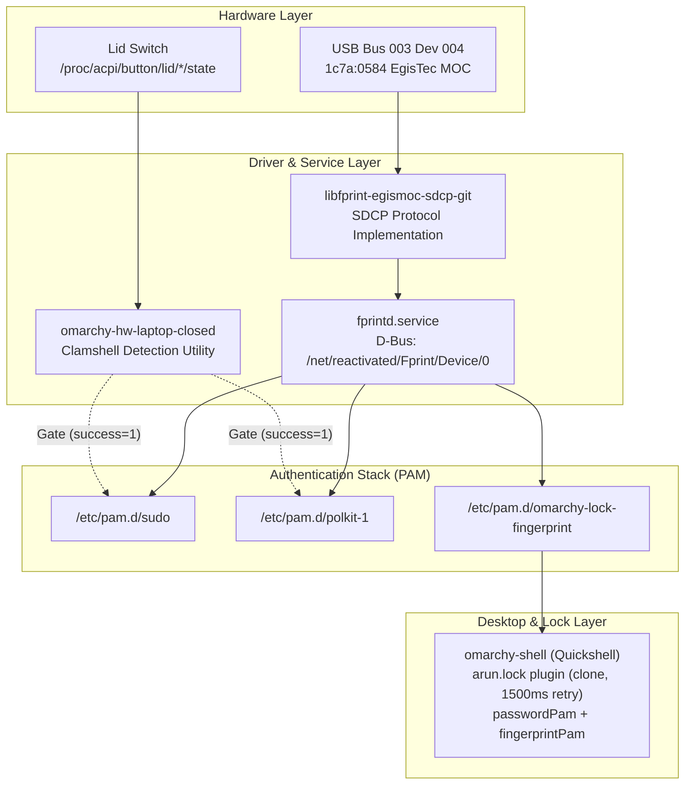

# Omarchy Quattro System Health & Authentication Audit

Health report, PAM architecture, hardware driver audit, and log diagnostics for **Omarchy 4**
on Arch Linux, checked against the upstream [`omacom/omarchy`](https://github.com/omacom/omarchy) reference.

**Audited:** 27 September 2026, on the Acer Swift Go 14 (`drakonis`) right after `./install.sh` on a
fresh Omarchy install. Every value below was read from the live system; the commands are in
[section 5](#5-diagnostic-runbook-read-only-commands) if you want to re-check.

---

## 1. Executive Health Summary

| Subsystem | Status | Details |
| :--- | :---: | :--- |
| **Operating System** | **Healthy** | Omarchy `4.0.4-1`, Linux `7.2.5-3-omarchy`, Arch Linux rolling release |
| **Systemd Services (System)** | **Healthy** | `0` failed system units (`systemctl --failed`) |
| **Systemd Services (User)** | **Healthy** | `0` failed user units (`systemctl --user --failed`) |
| **Storage & Mounts** | **Healthy** | Root (`/dev/mapper/root`) 475 GB, 451 GB available (5% used) |
| **Memory** | **Healthy** | 15 GiB RAM, 11 GiB available |
| **Crash & Core Dumps** | **Clean** | No coredumps (`coredumpctl list`) |
| **Hyprland Compositor** | **Healthy** | Hyprland `0.56.2-2` via `uwsm`; no config errors (`hyprctl configerrors`) |
| **Display / Monitor** | **Healthy** | Samsung OLED 2880x1800@90Hz on `eDP-1` |
| **Audio Stack** | **Healthy** | PipeWire + WirePlumber `0.5.17`; priority rules and SOF autoswitch deployed |
| **Fingerprint Hardware** | **Active** | EgisTec MOC (`1c7a:0584`) on `libfprint-egismoc-sdcp-git r1831.4d128d4-1`, 1 print enrolled |
| **fprintd Daemon** | **Active** | `fprintd 1.94.5`, D-Bus activated on demand; no errors this boot |
| **Lockscreen Auth** | **Verified** | Unlocked by finger twice this boot, ~1s each (journal) |
| **Sudo / Polkit PAM** | **Operational** | Fingerprint, then password through `system-auth`; lid gate silenced with `quiet_log` |
| **SSH Agent** | **Active** | `ssh-agent.socket` active; `AddKeysToAgent yes` |

`egismoc-fingerprint status` reports `ok` on all eight rows (sensor, driver, pin, enrollment,
sudo, polkit, lock PAM, lock plugin).

---

## 2. Hardware & Driver Architecture


```mermaid
flowchart TD
  subgraph Hardware ["Hardware Layer"]
    USB["USB Bus 003 Dev 004<br/>1c7a:0584 EgisTec MOC"]
    Lid["Lid Switch<br/>/proc/acpi/button/lid/*/state"]
  end

  subgraph Drivers ["Driver & Service Layer"]
    SDCP["libfprint-egismoc-sdcp-git<br/>SDCP Protocol Implementation"]
    FPRINTD["fprintd.service<br/>D-Bus: /net/reactivated/Fprint/Device/0"]
    CLAM["omarchy-hw-laptop-closed<br/>Clamshell Detection Utility"]
  end

  subgraph PAM ["Authentication Stack (PAM)"]
    SUDO["/etc/pam.d/sudo"]
    POLKIT["/etc/pam.d/polkit-1"]
    LOCK["/etc/pam.d/omarchy-lock-fingerprint"]
  end

  subgraph Shell ["Desktop & Lock Layer"]
    QS["omarchy-shell (Quickshell)<br/>arun.lock plugin (clone, 1500ms retry)<br/>passwordPam + fingerprintPam"]
  end

  USB --> SDCP --> FPRINTD
  Lid --> CLAM
  CLAM -.->|"Gate (success=1)"| SUDO
  CLAM -.->|"Gate (success=1)"| POLKIT
  FPRINTD --> SUDO
  FPRINTD --> POLKIT
  FPRINTD --> LOCK
  LOCK --> QS
```

### Sensor Specifications
* **Device Identification:** `Bus 003 Device 004: ID 1c7a:0584 LighTuning Technology Inc. ETU905A88-E`
* **Sensor Type:** EgisTec Match-on-Chip (MOC) capacitive touch sensor.
* **Driver:** `libfprint-egismoc-sdcp-git r1831.4d128d4-1`, installed from the checksum-verified
  archive in `packages/` and copied to `~/.local/share/packages/` and `/var/cache/pacman/pkg/`.
* **Driver Protection:** Locked against upgrades in `/etc/pacman.conf`:
  ```ini
  HoldPkg = pacman glibc
  IgnorePkg = libfprint libfprint-egismoc-sdcp-git
  ```
* **Update & Boot Automation** (deployed to `~/.config/omarchy/hooks/`):
  * `pre-refresh-pacman.d/lock-driver.hook` — re-adds `IgnorePkg` when `omarchy refresh pacman` resets `pacman.conf`
  * `post-update.d/lock-driver.hook` — re-checks `IgnorePkg`, repairs the lock-screen PAM timeout and the
    lid gate's `quiet_log` if a migration changed them, then runs `egismoc-fingerprint check`
  * `post-boot.d/egismoc-check.hook` — runs `egismoc-fingerprint check` (no sudo)

  `check` raises a clickable notification if the driver was replaced, and rebuilds the `arun.lock`
  clone if Omarchy changed its stock lock screen. The hooks reach it through the
  `~/.local/bin/egismoc-fingerprint` symlink into the repo; see
  [SETUP_AND_ARCHITECTURE.md](SETUP_AND_ARCHITECTURE.md#the-repo-folder-must-stay-put).

---

## 3. PAM & Log Diagnostics

### A. The "Exit Code 1" Log Noise — resolved

#### The Original Log Entry
```text
polkit-agent-helper-1[24366]: pam_exec(polkit-1:auth): /usr/bin/omarchy-hw-laptop-closed failed: exit code 1
```

#### Root Cause
Omarchy's stock clamshell gate is:
```pam
auth [success=1 default=ignore] pam_exec.so quiet /usr/bin/omarchy-hw-laptop-closed
```

1. When the lid is **open**, `omarchy-hw-laptop-closed` exits **`1`**.
2. `[default=ignore]` skips past that and moves on to `pam_fprintd.so`, as intended.
3. `pam_exec`'s `quiet` only suppresses messages to the user; it still logs a non-zero exit to the journal.
4. Only `quiet_log` silences that log line.

#### Current State
`egismoc-fingerprint setup` installs the gate with `quiet_log`, and the post-update hook re-adds it if
a migration puts back the stock line. This boot's journal has **0** `omarchy-hw-laptop-closed failed`
entries.

---

### B. Sudo PAM Stack

#### Configuration (`/etc/pam.d/sudo`)
```pam
#%PAM-1.0
auth      [success=1 default=ignore] pam_exec.so quiet quiet_log /usr/bin/omarchy-hw-laptop-closed
auth      sufficient pam_fprintd.so
auth		include		system-auth
account		include		system-auth
session		include		system-auth
session		optional	pam_systemd.so class=none
```

The two fingerprint lines are inserted after the `#%PAM-1.0` header, directly above the first `auth`
line. Apart from those two lines the file is byte-for-byte Arch's stock `sudo` — `setup` checks this
and restores the backup if anything else changed.

#### Operational Workflow
* **Lid Open (Normal):**
  * Touching the sensor satisfies `sufficient` and authorizes `sudo` immediately.
  * <kbd>Ctrl</kbd>+<kbd>C</kbd> at the fingerprint prompt (or a timeout) falls through to
    `include system-auth` for the password prompt.
* **Lid Closed (Clamshell Mode):**
  * `omarchy-hw-laptop-closed` exits `0`, so `[success=1]` skips `pam_fprintd.so`.
  * PAM goes straight to the password prompt with no sensor wait.
* **Non-Interactive (`sudo -n`):**
  * Scripts get `sudo: a password is required` immediately instead of hanging on the sensor.

---

### C. Lockscreen Auth & The 250ms Re-Arm Loop

#### Configuration (`/etc/pam.d/omarchy-lock-fingerprint`)
```pam
#%PAM-1.0
auth       required                    pam_fprintd.so timeout=-1 max-tries=-1
account    include                     system-local-login
```

The password path runs in parallel through Omarchy's untouched `/etc/pam.d/omarchy-lock-password`
(`pam_faillock` + `pam_unix`).

#### Why Two Fixes Are Needed
1. **Quickshell Architecture:** Omarchy's lock plugin (`/usr/share/omarchy/shell/plugins/lock/Service.qml`)
   runs two PAM contexts in parallel: `passwordPam` (`omarchy-lock-password`) and
   `fingerprintPam` (`omarchy-lock-fingerprint`).
2. **The Upstream Behavior:** whenever `fingerprintPam` errors out (including fprintd's default
   30-second timeout), `fingerprintRetryTimer` restarts it after **250 ms**:
   ```qml
   Timer {
     id: fingerprintRetryTimer
     interval: 250
     repeat: false
     onTriggered: root.startFingerprint()
   }
   ```
3. **Driver Impact:** the EgisTec sensor needs ~1.5 s to reset its USB state machine. Re-arming
   after 250 ms trips an assertion in the SDCP driver (`task_ssm == NULL`) and loops.
4. **Fix 1 — no timeout:** `timeout=-1 max-tries=-1` keeps the reader armed for as long as the
   screen is locked, so the 30-second timeout never fires.
5. **Fix 2 — slower retry:** any other error still goes through the retry timer, so
   `egismoc-fingerprint` clones the stock plugin (`omarchy plugin clone omarchy.lock` → `arun.lock`)
   and raises its interval to **1500 ms**. Live check:
   ```text
   /usr/share/omarchy/shell/plugins/lock/Service.qml     interval: 250
   ~/.config/omarchy/plugins/arun.lock/Service.qml        interval: 1500
   ```
   The clone doesn't get Omarchy's lock-screen updates by itself, so after every update and at boot
   `egismoc-fingerprint check` compares it with the stock plugin and rebuilds it if Omarchy changed it
   (never while the session is locked).

#### Journal Verification (this boot)
```text
omarchy-shell[21216]: quickshell.service.pam.subprocess: Starting pam session for user "arun" with config "omarchy-lock-fingerprint" in dir "/etc/pam.d"
omarchy-shell[21216]: quickshell.service.pam.subprocess: Relaying pam message: "Place your right index finger on the fingerprint reader" echo: 1 error: 0 responseRequired: 0
omarchy-shell[21216]: quickshell.service.pam.subprocess: Authenticated successfully.
```
* Unlocked by finger twice this boot (11:31:56 and 11:34:25), about 1 second after the prompt each time.
* No errors or assertions in `journalctl -u fprintd -b`.

---

### D. Polkit Stack (`/etc/pam.d/polkit-1`)

#### Configuration
```pam
#%PAM-1.0

auth      [success=1 default=ignore] pam_exec.so quiet quiet_log /usr/bin/omarchy-hw-laptop-closed
auth      sufficient pam_fprintd.so
auth       include      system-auth
account    include      system-auth
password   include      system-auth
session    include      system-auth
```

* On a fresh install `/etc/pam.d/polkit-1` doesn't exist; polkit uses the vendor copy in
  `/usr/lib/pam.d/polkit-1`. Once a file exists in `/etc/pam.d/`, Linux-PAM ignores the vendor copy,
  so `egismoc-fingerprint` starts from the vendor copy and adds only the two fingerprint lines.
* **Difference from upstream Omarchy:** Omarchy's `omarchy setup security fingerprint` writes a
  `pam_unix.so`-only polkit stack. Going through `system-auth` instead keeps Arch's
  `pam_faillock` (brute-force lockout) and any other `system-auth` policy on admin prompts.

---

## 4. Upstream `omacom/omarchy` Comparison

| Feature | Upstream Omarchy | Quattro Dotfiles Implementation | Status |
| :--- | :--- | :--- | :--- |
| **Driver Package** | `libfprint-git` (no egismoc SDCP) | `libfprint-egismoc-sdcp-git`, pinned PKGBUILD + checksum-verified binary | **Required** for EgisTec MOC (`1c7a:0584`) |
| **Driver Pinning** | None | `IgnorePkg` in `/etc/pacman.conf`, kept by the `pre-refresh-pacman` and `post-update` hooks | **Safeguarded** against upgrades |
| **Setup Entry Point** | *Setup › Security › Fingerprint* → `omarchy-setup-security-fingerprint` | Same menu entry, overridden to run `egismoc-fingerprint setup` | **Rerouted** (stock wizard would reinstall `libfprint-git`) |
| **Clamshell Gate** | `pam_exec.so quiet omarchy-hw-laptop-closed` | Same, plus `quiet_log` | **Working**, no log noise |
| **Sudo Fallback** | `auth sufficient pam_fprintd.so` | Same | **Working** (Ctrl+C or timeout → password) |
| **Polkit Stack** | `pam_unix.so` only | Vendor copy (`system-auth`) + fingerprint lines | **Keeps** `pam_faillock` |
| **Lock Screen PAM** | `auth required pam_fprintd.so` | `pam_fprintd.so timeout=-1 max-tries=-1` | **Fixed** (no 30s timeout re-arm) |
| **Lock Screen Plugin** | `omarchy.lock`, 250 ms retry | `arun.lock` clone, 1500 ms retry, auto-rebuilt after Omarchy updates | **Fixed** (no driver assertion loop) |

---

## 5. Diagnostic Runbook (Read-Only Commands)

### Fingerprint & Hardware Check
```bash
# Everything the fingerprint setup manages, one line each
egismoc-fingerprint status

# USB enumeration
lsusb | grep -i "1c7a:0584"

# Enrolled fingerprints
fprintd-list "$USER"

# Driver pin
grep -E '^(HoldPkg|IgnorePkg)' /etc/pacman.conf
```

### Authentication Logs Audit
```bash
# fprintd logs since boot
journalctl -u fprintd -b --no-pager

# Lock-screen PAM sessions and results
journalctl -b --no-pager | grep -E 'omarchy-lock-fingerprint|pam.subprocess: Authenticated'

# Lid-gate noise (should be 0 with quiet_log)
journalctl -b --no-pager | grep -c 'omarchy-hw-laptop-closed failed'

# Any PAM or sudo auth failures
journalctl -b --no-pager | grep -iE "pam_unix\(.*:auth\)|pam_exec"
```

### System Health Quick Check
```bash
systemctl --failed
systemctl --user --failed
hyprctl configerrors
coredumpctl list
```
